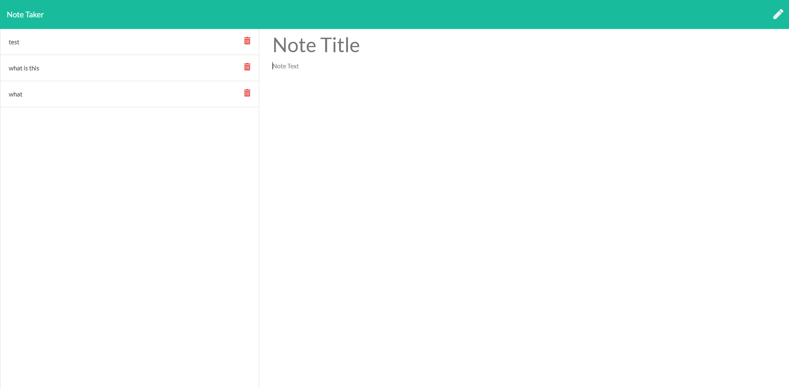

# note-taker

    
## Description
A webpage that uses a database to store notes.

## Table of Contents
* [Usage Information](#usage-information)
* [License Information](#license-information)

## Usage Information
Create notes and store them to a database to be accessed in the future.

## License Information
Licensed under the [MIT_License](LICENSE)

### Image of Website

### Questions
- For further questions please reach out through the following:
    - Email: cory.c.calaway@gmail.com
    - GitHub: https://github.com/corycalaway/note-taker
    - Heroku: https://morning-wave-29518.herokuapp.com/
